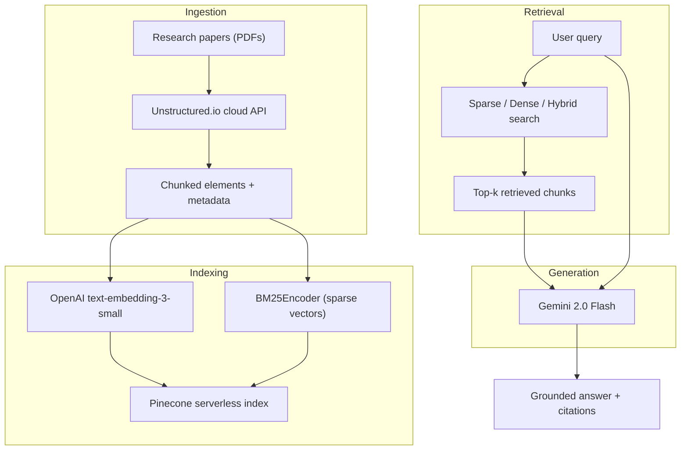

# Research Paper RAG — Hybrid Retrieval Evaluation

A Retrieval-Augmented Generation system for querying research papers, with an empirical comparison of how **sparse**, **dense**, and **hybrid** retrieval strategies affect LLM output quality.

## Architecture



## Tech stack

| Layer | Tool |
|---|---|
| Document parsing | Unstructured.io (cloud API) |
| Embeddings | OpenAI `text-embedding-3-small` |
| Sparse vectors | `pinecone-text` BM25Encoder |
| Vector store | Pinecone (serverless) |
| LLM | Google Gemini `gemini-2.0-flash` |
| UI | Streamlit |
| Language | Python >= 3.11 |

## Setup

```bash
# Clone the repo
git clone https://github.com/<username>/HybridRAG-Bench.git
cd HybridRAG-Bench

# Create virtual environment
python -m venv venv
source venv/bin/activate  # or venv\Scripts\activate on Windows

# Install dependencies
pip install -r requirements.txt

# Add API keys to .env
cp .env.example .env
# Edit .env with your keys
```

## Usage

```bash
# Ingest papers
python ingest.py

# Run the app
streamlit run app.py

# Run evaluation
python evaluate.py
```

## Experiment

<!-- TODO: describe the experiment after running it -->

**Hypothesis**: hybrid retrieval (sparse + dense) produces more faithful and relevant LLM answers than either mode alone, particularly on research papers with mixed keyword-heavy and conceptual queries.

### Retrieval modes tested

| Mode | Pinecone alpha | Description |
|---|---|---|
| Sparse only | 0.0 | BM25 keyword matching |
| Dense only | 1.0 | Semantic similarity via embeddings |
| Hybrid | 0.5 | Weighted blend of sparse and dense |

### Evaluation criteria

Each answer scored on a 1–5 rubric across three dimensions:
- **Faithfulness**: is the answer grounded in the retrieved context?
- **Relevance**: does it answer the question?
- **Completeness**: does it capture all relevant information?

### Results

<!-- TODO: fill in after evaluation -->

| Retrieval mode | Faithfulness | Relevance | Completeness | Avg score | Avg latency |
|---|---|---|---|---|---|
| Sparse only | — | — | — | — | — |
| Dense only | — | — | — | — | — |
| Hybrid | — | — | — | — | — |

### Key findings

<!-- TODO: fill in after analysis -->

## Project structure

```
├── app.py                  # Streamlit UI
├── ingest.py               # Ingestion pipeline
├── retrieve.py             # Retrieval logic (sparse, dense, hybrid)
├── generate.py             # LLM generation
├── evaluate.py             # Evaluation harness
├── config.py               # Centralized configuration
├── papers/                 # Source PDFs
├── results/                # Evaluation outputs
├── requirements.txt
├── PLAN.md                 # Detailed project plan and future work
├── .env.example
└── README.md
```

## Future work

- Chunking strategy comparison (element-based vs fixed-size)
- Top-k sensitivity analysis
- Cross-encoder reranking
- Cost-per-query analysis
- Deployment as a public web app

See [PLAN.md](PLAN.md) for detailed descriptions of each.

## License

<!-- TODO: update if needed -->

See [LICENSE](LICENSE).
